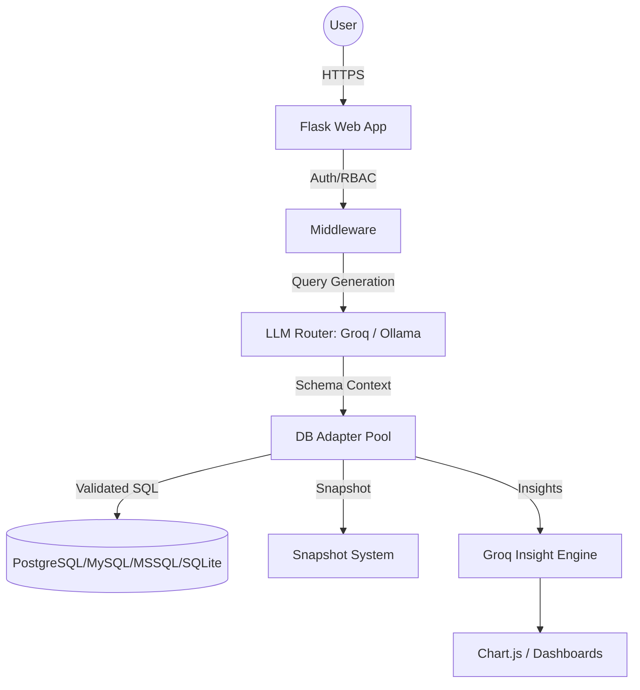

# Meridian Data

### **AI-Powered Insights. Real-Time Decisions.**

Meridian Data is a premium, full-stack AI analytics platform that converts natural language into validated SQL, executes queries against complex enterprise databases, and delivers actionable insights through interactive dashboards. Built for speed and security, it bridges the gap between raw data and decision-makers.

Connect your own **PostgreSQL, MySQL, MSSQL, Oracle, or SQLite** databases with high-performance connection pooling, and let the AI handle everything from schema discovery to predictive trend analysis—no SQL knowledge required.

---

## Key Features

### Core Intelligence

- **Natural Language to SQL**: A sophisticated 10-step NL2SQL pipeline utilizing TF-IDF schema ranking and semantic context injection.
- **Dialect-Aware Reasoning**: Native support for various SQL dialects and NoSQL structures (MongoDB, Redis).
- **Conversation Context**: State-aware follow-up queries supported with a sliding window context from previous interactions.
- **Smart Chart Recommendations**: Automated visualization selection (Bar, Line, Pie, Area, Scatter) optimized for data distribution.

### Mutations & Safety

- **Human-in-the-Loop Review**: All write operations (INSERT, UPDATE, DELETE) undergo a strict human-review flow with SQL syntax highlighting.
- **Impact Preview**: Predictive row-count Analysis for DELETE statements before execution.
- **Snapshot-Based Rollback**: One-click database restoration using lightweight snapshots for write operations.
- **SQL Guardrails**: Middleware-level keyword filtering, multi-statement blocking, and read-only transaction enforcement.

### LLM Administration & Analytics

- **Dual-Provider Router**: Dynamic routing between **Groq (Cloud AI - Llama 3.3)** and **Ollama (Local AI - Mistral)** with automatic failover.
- **Granular Usage Tracking**: Real-time telemetry for latency, token consumption, and provider distribution.
- **Admin Test Console**: Direct LLM probing with raw JSON output for debugging and tuning.
- **Local Model Manager**: In-app interface to pull and manage local Ollama models.

---

## Technical Architecture

### **Layered System Overview**



### **Tech Stack**

| Layer                | Technologies                                                                   |
| :------------------- | :----------------------------------------------------------------------------- |
| **Frontend**         | Vanilla HTML5/CSS3 (Premium Dark Mode), Chart.js, Glassmorphism, CSS Variables |
| **Backend**          | Python 3.11+, Flask                                                            |
| **AI (Cloud)**       | Groq SDK (Llama 3.3 70B Versatile)                                             |
| **AI (Local)**       | Ollama (Mistral / Llama 3)                                                     |
| **Database Support** | SQLite, PostgreSQL, MySQL, MSSQL, Oracle                                       |
| **Persistence**      | File-based JSON state (Metrics, Dashboards, Connections)                       |

---

## File Structure

```text
.
├── app.py                  # Core Flask Application & API Router
├── core/                   # Backend Logic & Modular Services
│   ├── adapters/           # Multi-Dialect Connector Framework
│   │   ├── base.py         # Abstract Database Adapter Interface
│   │   ├── sqlite_adapter.py
│   │   ├── postgres_adapter.py
│   │   ├── mysql_adapter.py
│   │   ├── mssql_adapter.py
│   │   ├── oracle_adapter.py
│   │   ├── mongo_adapter.py
│   │   ├── cassandra_adapter.py
│   │   └── redis_adapter.py
│   ├── analyzer.py         # AI Result & Schema Analysis Engine
│   ├── connection_manager.py # Pooled Lifecycle & Workspace Control
│   ├── csv_parser.py       # Raw Data Ingestion Utility
│   ├── dashboards.py       # Persistence Logic for Visualizations
│   ├── llm.py              # NL2SQL Pipeline & Context Management
│   ├── llm_manager.py      # Provider Analytics & API Control
│   ├── metrics.py          # Telemetry & Usage Aggregation
│   ├── snapshot.py         # DB Backup & Reversion Flow
│   └── validator.py        # SQL Safety Guardrails & Intent Parsing
├── db/                     # High-Performance Data Persistence
│   ├── main.db             # Default Local Working Database
│   ├── connections.json    # Encrypted Backend Connection Registry
│   ├── dashboards.json     # Permanent Dashboard State
│   ├── usage_metrics.json  # Aggregated Analytics Time-Series
│   └── snapshots/          # Point-in-Time Database Recovery Files
├── static/                 # Design Systems & Visual Logic
│   └── style.css           # Premium Dark/Glassmorphic Styling
├── templates/              # Jinja2 Layout Framework
│   ├── index.html          # Primary Query Analysis Interface
│   ├── login.html          # Secure RBAC Access Gateway
│   ├── admin.html          # Provider Telemetry & Usage Dashboard
│   ├── dashboards.html     # Persistence Analytics Listing
│   ├── dashboard_view.html # Interactive Data Presentation Grid
│   ├── databases.html      # Multi-DB Lifecycle Manager
│   └── review.html         # Human-in-the-Loop Review Pipeline
├── requirements.txt        # Enterprise Dependency Specification
└── .env                    # Secure Environment Configuration
```

---

## API Endpoints

### **Authentication**

- `POST /login`: Secure session-based authentication with bcrypt hashing.
- `GET /logout`: Terminate session and clear state.

### **Query Engine**

- `POST /`: Submit natural language query -> LLM pipeline -> review flow.
- `POST /execute`: Final commit for reviewed and validated SQL queries.
- `POST /analyze`: Generate AI insights and trend analysis on query results.
- `GET /export`: Export active query results to professional CSV format.

### **Database Management**

- `GET /databases`: View all connected database assets.
- `POST /databases/add`: Add a new database connection with encrypted credentials.
- `POST /databases/test`: Perform heartbeat check on an existing connection.
- `POST /databases/select`: Hot-swap the active global workspace.
- `POST /databases/delete`: Decommission a database connection.

### **LLM Administration**

- `GET /admin`: Complete usage dashboard with real-time Chart.js telemetry.
- `POST /admin/llm/config`: Update global provider settings and API Keys.
- `POST /admin/ollama/pull`: Trigger async background pull of local models.
- `POST /admin/test_llm`: RAW prompt debugging terminal.

### **Snapshot & Safety**

- `GET /snapshots`: View all database backup points.
- `POST /snapshots/create`: Take an instant on-demand DB snapshot.
- `POST /snapshots/restore`: Restore database state to a specific point in time.
- `POST /undo`: Fast one-click revert of the most recent write operation.

### **Visual Dashboards**

- `GET /dashboards`: Multi-dashboard listing and management.
- `POST /api/dashboards`: Create a persistent dashboard workspace.
- `POST /api/dashboards/auto-generate`: AI-planner that builds full dashboards based on business goals.
- `POST /api/dashboards/{id}/widgets`: Manually pin analytics widgets to a workspace.

---

## Security & Reliability

Meridian Data is designed with enterprise-grade guardrails:

- **AES-256-GCM Encryption**: All database passwords stored at rest are encrypted with an environment-derived key.
- **RBAC Enforcement**: Granular permissions (Admin, Editor, Viewer) control every action from schema-changes to read-only views.
- **Query Guardrails**: Prevents SQL injection, multi-statement attacks, and unauthorized schema modifications.
- **Failover Logic**: Automatic routing to local Ollama if Groq API hits rate limits or latency spikes.

---

## Setup Instructions

1. **Prepare Environment**: Install Python 3.11+ and [Ollama](https://ollama.com).
2. **Install Dependencies**: `pip install -r requirements.txt`.
3. **Configure Environment**: Set `GROQ_API_KEY` in `.env`.
4. **Bootstrapping**:
   ```bash
   ollama pull mistral  # Prepare local fall-back
   python app.py        # Spin up Meridian Data
   ```
5. **Access Gateway**: Navigate to `http://127.0.0.1:5000` to begin.

---

**Meridian Data**: _Precision in Intelligence, Authority in Data._
